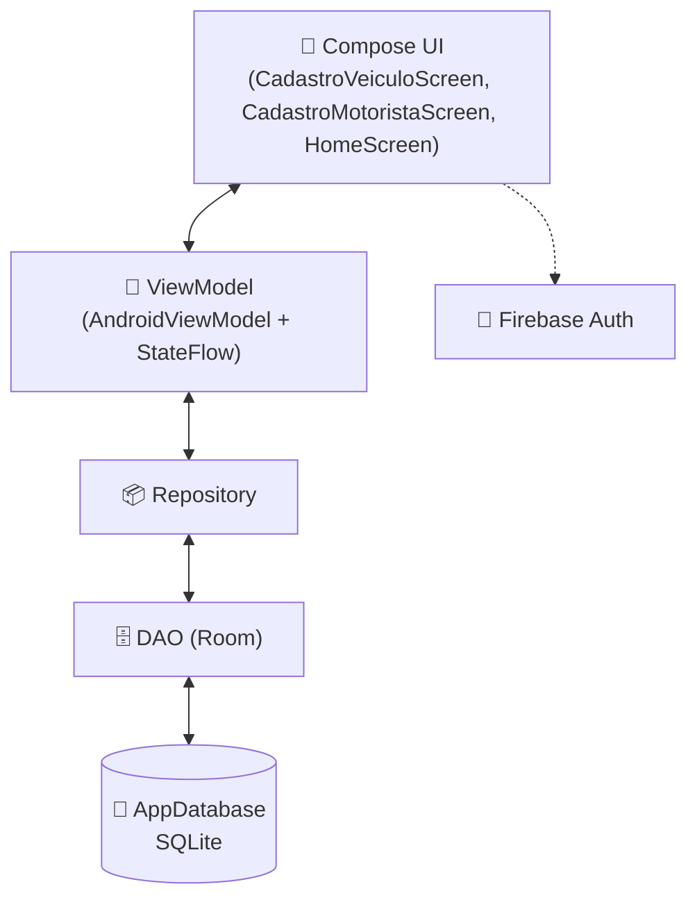

<div align="center">

# 🚚 Rastreador de Frota

### Sistema de Rastreamento de Frota de Veículos de Entrega

_Projeto desenvolvido para a disciplina **Desenvolvimento para Dispositivos Móveis 2 (DDM2)**_
_**IFSP Araraquara**_

[](https://kotlinlang.org)
[](https://developer.android.com/jetpack/compose)
[](https://firebase.google.com/)
[](https://developer.android.com/training/data-storage/room)
[](https://developer.android.com)

</div>

---

## 👥 Autores

| Nome | Papel |
|---|---|
| **Otavio Baroni** | Desenvolvedor |
| **Rafael Matias** | Desenvolvedor |

> 📚 Disciplina: **DDM2 — Desenvolvimento para Dispositivos Móveis 2**
> 🏫 Instituição: **IFSP — Câmpus Araraquara**

---

## 📱 Sobre o Projeto

O **Rastreador de Frota** é um aplicativo Android voltado para o **gerenciamento e rastreamento de frotas de veículos de entrega**, permitindo o cadastro de veículos, motoristas e o acompanhamento das operações da frota de forma simples e organizada.

O projeto segue o cronograma da disciplina, com **entregas quinzenais** e a exigência de **PoCs (Provas de Conceito)** isoladas, demonstrando o uso individual de cada tecnologia estudada no semestre.

---

## 🛠️ Stack Tecnológica

<div align="center">

| Camada | Tecnologia |
|---|---|
| 🎨 **UI** | Jetpack Compose |
| 🔐 **Autenticação** | Firebase Auth |
| 💾 **Persistência local** | Room / SQLite |
| 🧠 **Arquitetura** | MVVM (`AndroidViewModel` + `StateFlow`) |
| 💻 **Linguagem** | Kotlin |
| 📝 **Commits** | Conventional Commits |

</div>

---

## 📂 Estrutura de PoCs

Cada entrega exige uma **Prova de Conceito isolada**, demonstrando o uso individual da tecnologia estudada, organizada da seguinte forma:

```
pocs/
└── <entrega>/
    └── <nome-da-poc>/
```

<details>
<summary>📌 <b>Ver PoCs já desenvolvidas</b></summary>

<br>

| Entrega | PoC | Descrição |
|---|---|---|
| Entrega 2 | App de notas com Room | Demonstra o uso isolado do Room/SQLite para persistência local |
| Entrega 4 | Fotos locais | Demonstra captura e persistência no filesystem do dispositivo |
| Entrega 5 | Mapa da frota (`e5-mapa/otavio`) | Mapa OpenStreetMap com osmdroid e marcador com posições simuladas |
| Entrega 5 | Simulador de telemetria (`e5-mapa/rafael`) | Sequência pré-determinada de posições com telemetria, loop único com `StateFlow` e cor do marcador por status |
| Entrega 6 | Geração de rotas (`e6-rotas/rafael`) | Localização atual (FusedLocationProvider), destino com toque longo, rota por ruas no OSRM desenhada como `Polyline` e veículo simulado percorrendo a rota |

</details>

---

## ✅ Progresso do Projeto

<details open>
<summary>🧭 <b>Entrega 6 / Semana 13 — Geração de rotas</b></summary>

<br>

- [x] Viagens simuladas **pelas ruas**: CD → entrega → CD, com trajetos fixos gerados uma vez no OSRM (sem rede na simulação)
- [x] Linha do trajeto restante de cada veículo, que encolhe conforme ele chega; marcadores do CD e da entrega
- [x] "Indo para Rua X · faltam 2,3 km · 4 min" na lista e no painel; motorista vê a rota do próprio veículo
- [x] Rota por ruas da localização atual até um veículo da frota (botão no painel do veículo)
- [x] Rota até um destino de entrega escolhido com toque longo no mapa
- [x] Serviço OSRM (OpenStreetMap), sem API key: linha da rota, distância e tempo estimado
- [x] Localização atual pelo FusedLocationProvider, com permissão pedida em tempo de execução
- [x] Sem permissão ou fora da região (emulador): a rota parte do centro de distribuição, com aviso
- [x] Recalcular até a posição atual do veículo; erro amigável sem internet
- [x] Disponível para controlador e motorista
- [x] PoC `pocs/e6-rotas/rafael` (rotas com OSRM)

Detalhes, roteiro de teste e roteiro de apresentação: [`docs/entrega6.md`](docs/entrega6.md)

</details>

<details>
<summary>🗺️ <b>Entrega 5 / Semana 11 — Veículos parados e em trânsito no mapa</b></summary>

<br>

- [x] Simulação de posição e telemetria no próprio app (`simulacao/`): rotas pré-determinadas em Araraquara, com velocidade, motor e portas em cada ponto
- [x] Passo da simulação derivado do relógio: não reinicia ao sair do mapa e fica igual em todos os aparelhos
- [x] Marcador verde (em trânsito) ou âmbar (parado), criado uma vez e só atualizado a cada passo
- [x] Filtro Todos / Em trânsito / Parados, com contagem
- [x] Painel de telemetria do veículo selecionado; o mapa segue o veículo
- [x] Motorista vê só o veículo associado a ele
- [x] PoC `pocs/e5-mapa/rafael` (simulador de telemetria)

Detalhes, roteiro de teste e roteiro de apresentação: [`docs/entrega5.md`](docs/entrega5.md)

</details>

<details>
<summary>📦 <b>Entrega 4 / Semana 9 — Concluída</b></summary>

<br>

**Camada de dados (Room/SQLite)**
- [x] `VeiculoEntity`
- [x] `MotoristaEntity`
- [x] Enum `TipoVeiculo`
- [x] DAOs
- [x] `AppDatabase` (singleton)

**Camada de domínio/apresentação**
- [x] Classes de `Repository`
- [x] `ViewModel`s baseados em `AndroidViewModel` usando `StateFlow`

**Interface (Compose)**
- [x] `CadastroVeiculoScreen` — formulário + lista em tempo real
- [x] `CadastroMotoristaScreen` — formulário + lista em tempo real
- [x] Atualização do `NavGraph.kt` (novas rotas)
- [x] Dashboard da frota na `HomeScreen.kt`

**Fotos locais**
- [x] Captura pela câmera ou seleção na galeria
- [x] Cópia para o armazenamento interno privado do dispositivo
- [x] Caminho da foto persistido localmente no Room
- [x] Remoção do arquivo ao remover o veículo

**PoC**
- [x] Projeto isolado demonstrando Room com app de notas

</details>

<details>
<summary>🔜 <b>Próximas entregas</b></summary>

<br>

- **Entrega 7 / Semana 15 (04/11):** endereço a partir das coordenadas (reverse geocoding)
- **Entrega 8 / Semana 17 (18/11):** notificações de geofencing (entrada e saída de perímetro)

</details>

---

## 🧩 Arquitetura



---

## 💡 Aprendizados & Soluções de Problemas

<details>
<summary>⚠️ <b>Divergência de nome de pacote</b></summary>

<br>

O Android Studio pode gerar um `package ID` (ex: `com.example.pocsqlite_otavio`) diferente do que foi digitado manualmente nos arquivos `.kt`.

**Solução:** usar *Find & Replace* em todos os arquivos Kotlin do projeto para padronizar o nome do pacote.

</details>

<details>
<summary>⚠️ <b>Conflito de import no Material3 (ExposedDropdownMenu)</b></summary>

<br>

O componente `ExposedDropdownMenu` apresenta conflitos de import a partir do Material3 1.3+.

**Solução:** remover o import explícito e utilizar o escopo `ExposedDropdownMenuBoxScope` diretamente.

</details>

<details>
<summary>⚠️ <b>Firebase Auth não funciona no emulador</b></summary>

<br>

Emuladores sem Google Play Store (rotulados apenas como "Google APIs") não conseguem concluir a verificação reCAPTCHA/Play Integrity exigida pelos SDKs mais recentes do Firebase Auth.

**Solução:** utilizar um AVD com Play Store habilitada ou testar em um dispositivo físico.

</details>

---

## 📝 Convenção de Commits

Este projeto segue o padrão **[Conventional Commits](https://www.conventionalcommits.org/)**:

```bash
feat: adiciona tela de cadastro de motorista
fix: corrige conflito de import do ExposedDropdownMenu
docs: atualiza README com progresso da entrega 2
chore: configura AppDatabase como singleton
```

---

## 🚀 Como Executar

1. Clone o repositório
2. Abra o projeto no **Android Studio**
3. Configure um **AVD com Google Play Store** (necessário para o Firebase Auth) ou use um dispositivo físico
4. Rode o projeto (`Run ▶️`)

---

<div align="center">

**Feito com 💚 por Otavio Baroni & Rafael Matias**
_IFSP Araraquara — DDM2_

</div>
